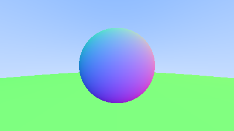
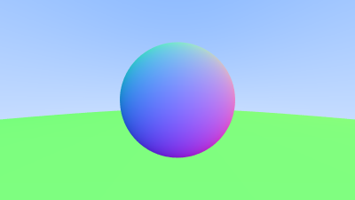
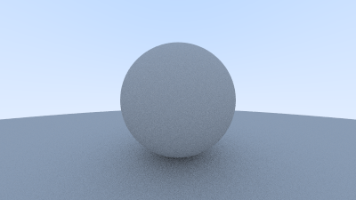

# A simple raytracer in Rust

Learning about ray tracing from this [book](https://raytracing.github.io/books/RayTracingInOneWeekend.html).

# Renders

## First render

## Antialiasing

## Diffuse reflection and gamma correction

