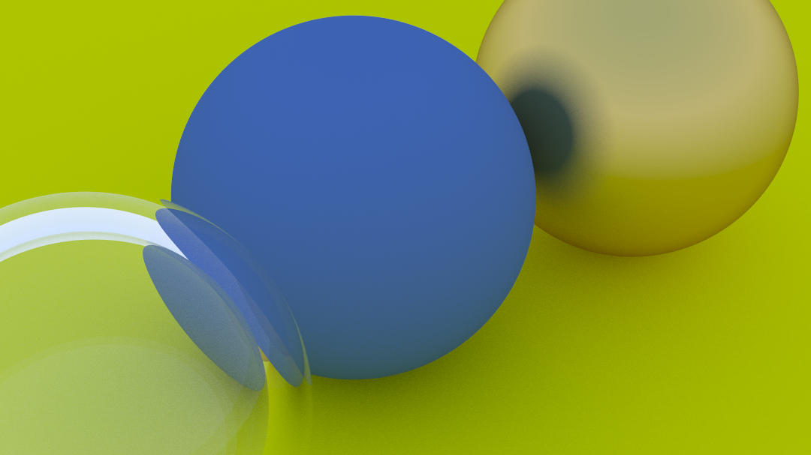

# A simple raytracer in Rust

Learning about ray tracing from this [book](https://raytracing.github.io/books/RayTracingInOneWeekend.html).

# Renders

## First render

## Antialiasing

## Diffuse reflection and gamma correction

## Materials matte and metal

### Reflective metal

### Metal with fuzz

## Refraction without TIR

## Refraction with TIR

## Hollow sphere with Schlick's approximation

## Camera displacement and FOV

## Depth of field

## Final Render with multiple balls

